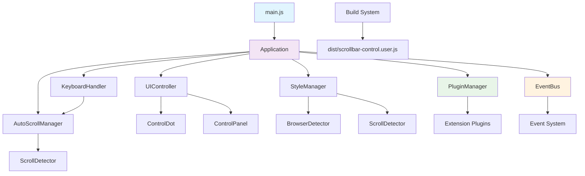

# 项目重构设计文档

## 概述

本设计文档描述了如何将现有的单文件油猴脚本重构为模块化架构，建立完整的开发工作流，并为未来的网页自动化控制功能预留扩展接口。重构将采用现代JavaScript模块系统，建立清晰的架构分层和依赖管理。

## 架构

### 项目目录结构

```
scrollbar-controller/
├── src/                          # 源代码目录
│   ├── core/                     # 核心模块
│   │   ├── Application.js        # 主应用类
│   │   ├── EventBus.js           # 事件总线
│   │   └── PluginManager.js      # 插件管理器
│   ├── managers/                 # 管理器模块
│   │   ├── StyleManager.js       # 样式管理器
│   │   ├── AutoScrollManager.js  # 自动滚动管理器
│   │   └── KeyboardHandler.js    # 键盘处理器
│   ├── ui/                       # 用户界面模块
│   │   ├── UIController.js       # UI控制器
│   │   ├── ControlDot.js         # 控制圆点组件
│   │   └── ControlPanel.js       # 控制面板组件
│   ├── detectors/                # 检测器模块
│   │   ├── ScrollDetector.js     # 滚动检测器
│   │   └── BrowserDetector.js    # 浏览器检测器
│   ├── utils/                    # 工具模块
│   │   ├── constants.js          # 常量定义
│   │   ├── helpers.js            # 辅助函数
│   │   └── logger.js             # 日志工具
│   ├── extensions/               # 扩展模块目录
│   │   └── README.md             # 扩展开发指南
│   └── main.js                   # 入口文件
├── build/                        # 构建脚本目录
│   ├── build.js                  # 构建脚本
│   ├── template.js               # 脚本模板
│   └── utils.js                  # 构建工具
├── dist/                         # 构建产物目录
│   └── scrollbar-control.user.js # 生成的油猴脚本
├── .github/                      # GitHub配置
│   └── workflows/
│       └── build.yml             # CI/CD工作流
├── docs/                         # 文档目录
│   ├── architecture.md          # 架构文档
│   ├── development.md           # 开发指南
│   └── extensions.md            # 扩展开发指南
├── .gitignore                    # Git忽略文件
├── package.json                  # 项目配置
└── README.md                     # 项目说明
```

### 核心架构设计



## 组件和接口

### 核心模块

#### Application 类
```javascript
class Application {
    constructor()
    initialize()
    destroy()
    getManager(name: string)
    registerPlugin(plugin: Plugin)
    emit(event: string, data: any)
    on(event: string, handler: function)
}
```

**职责：**
- 应用程序的主入口和生命周期管理
- 协调各个管理器和组件的初始化
- 提供统一的事件通信机制
- 管理插件系统

#### EventBus 类
```javascript
class EventBus {
    constructor()
    on(event: string, handler: function)
    off(event: string, handler: function)
    emit(event: string, data: any)
    once(event: string, handler: function)
}
```

**职责：**
- 提供组件间的解耦通信机制
- 支持事件的订阅、发布和取消订阅
- 为插件系统提供事件接口

#### PluginManager 类
```javascript
class PluginManager {
    constructor(eventBus: EventBus)
    registerPlugin(plugin: Plugin)
    unregisterPlugin(pluginId: string)
    getPlugin(pluginId: string)
    loadExtensions()
}
```

**职责：**
- 管理插件的注册、加载和卸载
- 为扩展功能提供标准化接口
- 支持动态加载扩展模块

### 管理器模块

#### StyleManager 类
```javascript
class StyleManager {
    constructor(eventBus: EventBus, browserDetector: BrowserDetector)
    setMode(mode: string)
    showScrollbar()
    hideScrollbar()
    cleanup()
}
```

**职责：**
- 管理滚动条样式的动态注入
- 处理不同浏览器的兼容性
- 通过事件系统通知状态变化

#### AutoScrollManager 类
```javascript
class AutoScrollManager {
    constructor(eventBus: EventBus)
    enable()
    disable()
    startAutoScroll()
    stopAutoScroll()
    setSpeed(speed: number)
}
```

**职责：**
- 管理自动滚动功能
- 提供平滑滚动动画
- 支持速度控制和边界检测

### 用户界面模块

#### UIController 类
```javascript
class UIController {
    constructor(eventBus: EventBus, styleManager: StyleManager)
    initialize()
    createControlDot()
    createControlPanel()
    destroy()
}
```

**职责：**
- 协调UI组件的创建和管理
- 处理用户交互事件
- 与管理器模块通信

#### ControlDot 类
```javascript
class ControlDot {
    constructor(eventBus: EventBus)
    create()
    show()
    hide()
    destroy()
}
```

**职责：**
- 创建和管理控制圆点
- 处理点击事件
- 提供视觉反馈

#### ControlPanel 类
```javascript
class ControlPanel {
    constructor(eventBus: EventBus)
    create()
    show()
    hide()
    updateState(state: object)
    destroy()
}
```

**职责：**
- 创建和管理控制面板
- 处理用户设置变更
- 同步UI状态

### 扩展系统设计

#### Plugin 接口
```javascript
interface Plugin {
    id: string
    name: string
    version: string
    initialize(application: Application): void
    destroy(): void
    getAPI?(): object
}
```

#### 扩展点定义
```javascript
const ExtensionPoints = {
    BEFORE_INIT: 'before-init',
    AFTER_INIT: 'after-init',
    STYLE_CHANGE: 'style-change',
    SCROLL_EVENT: 'scroll-event',
    UI_INTERACTION: 'ui-interaction',
    CUSTOM_CONTROL: 'custom-control'
};
```

## 数据模型

### 应用状态对象
```javascript
const ApplicationState = {
    initialized: false,
    currentMode: 'default',
    autoScrollEnabled: false,
    autoScrollSpeed: 3,
    uiVisible: false,
    plugins: new Map()
};
```

### 事件类型定义
```javascript
const EventTypes = {
    // 应用生命周期
    APP_INIT: 'app:init',
    APP_DESTROY: 'app:destroy',
    
    // 样式相关
    STYLE_MODE_CHANGE: 'style:mode-change',
    SCROLLBAR_SHOW: 'scrollbar:show',
    SCROLLBAR_HIDE: 'scrollbar:hide',
    
    // 滚动相关
    SCROLL_START: 'scroll:start',
    SCROLL_END: 'scroll:end',
    AUTO_SCROLL_START: 'auto-scroll:start',
    AUTO_SCROLL_STOP: 'auto-scroll:stop',
    
    // UI相关
    UI_PANEL_TOGGLE: 'ui:panel-toggle',
    UI_MODE_SELECT: 'ui:mode-select',
    UI_SPEED_CHANGE: 'ui:speed-change',
    
    // 插件相关
    PLUGIN_REGISTER: 'plugin:register',
    PLUGIN_UNREGISTER: 'plugin:unregister'
};
```

### 配置对象
```javascript
const Config = {
    scrollbar: {
        modes: ['default', 'always', 'semi'],
        defaultMode: 'default'
    },
    autoScroll: {
        minSpeed: 1,
        maxSpeed: 10,
        defaultSpeed: 3,
        frameRate: 60
    },
    ui: {
        dotSize: 20,
        panelWidth: 200,
        zIndex: 999999
    },
    extensions: {
        enabled: true,
        autoLoad: true
    }
};
```

## 构建系统设计

### 构建流程


### 构建脚本功能

1. **依赖分析**
   - 解析ES6模块的import/export语句
   - 构建依赖关系图
   - 确定模块加载顺序

2. **代码合并**
   - 按依赖顺序合并模块代码
   - 移除import/export语句
   - 处理模块作用域

3. **代码转换**
   - 转换ES6语法为兼容性更好的ES5
   - 压缩和优化代码
   - 添加错误处理

4. **元数据处理**
   - 添加油猴脚本头部信息
   - 设置脚本权限和匹配规则
   - 添加版本和描述信息

### 构建配置

```javascript
// build/config.js
const buildConfig = {
    entry: 'src/main.js',
    output: 'dist/scrollbar-control.user.js',
    userscriptMeta: {
        name: 'Scrollbar Controller',
        namespace: 'http://tampermonkey.net/',
        version: '2.0.0',
        description: '提供对网页滚动条显示的精细控制，支持三种显示模式和自动滚动',
        author: 'karminski-牙医',
        match: '*://*/*',
        grant: 'none',
        runAt: 'document-end',
        noframes: true
    },
    minify: false,
    sourcemap: false
};
```

## CI/CD 工作流设计

### GitHub Actions 工作流

```yaml
name: Build Userscript
on:
  push:
    branches: [ main, develop ]
  pull_request:
    branches: [ main ]

jobs:
  build:
    runs-on: ubuntu-latest
    steps:
      - uses: actions/checkout@v3
      - uses: actions/setup-node@v3
        with:
          node-version: '18'
      - run: npm install
      - run: npm run build
      - run: npm run test
      - uses: actions/upload-artifact@v3
        with:
          name: userscript
          path: dist/
```

### 构建脚本命令

```json
{
  "scripts": {
    "build": "node build/build.js",
    "build:dev": "node build/build.js --dev",
    "build:watch": "node build/build.js --watch",
    "test": "echo 'Tests will be added later'",
    "lint": "eslint src/",
    "clean": "rimraf dist/"
  }
}
```

## 错误处理和兼容性

### 错误处理策略

1. **模块加载错误**
   - 提供降级机制
   - 记录详细错误信息
   - 尝试部分功能恢复

2. **浏览器兼容性**
   - 保持现有的BrowserDetector功能
   - 为不支持的浏览器提供警告
   - 确保基本功能可用

3. **插件系统错误**
   - 隔离插件错误，不影响核心功能
   - 提供插件错误报告机制
   - 支持插件的热重载

### 向后兼容性

- 保持所有现有功能的API不变
- 确保用户体验完全一致
- 支持旧版本配置的迁移

## 扩展性设计

### 网页自动化控制扩展点

1. **页面元素控制**
   - 提供元素选择和操作API
   - 支持DOM事件监听和触发
   - 提供页面状态检测接口

2. **自动化脚本引擎**
   - 支持脚本录制和回放
   - 提供条件判断和循环控制
   - 支持异步操作和等待机制

3. **用户交互模拟**
   - 支持鼠标点击和移动模拟
   - 支持键盘输入模拟
   - 支持表单填充和提交

### 扩展开发接口

```javascript
// 扩展示例
class PageControlExtension {
    constructor() {
        this.id = 'page-control';
        this.name = 'Page Control Extension';
        this.version = '1.0.0';
    }
    
    initialize(application) {
        const eventBus = application.getEventBus();
        const pluginManager = application.getManager('plugin');
        
        // 注册自定义控制面板
        eventBus.on('ui:panel-create', this.addControlPanel.bind(this));
        
        // 注册页面控制API
        this.registerPageControlAPI(application);
    }
    
    addControlPanel(panel) {
        // 添加页面控制相关的UI元素
    }
    
    registerPageControlAPI(application) {
        // 注册页面控制相关的API
    }
}
```

## 测试策略

### 单元测试
- 对每个模块进行独立测试
- 测试模块间的接口契约
- 验证错误处理逻辑

### 集成测试
- 测试模块间的协作
- 验证事件系统的正确性
- 测试插件系统的功能

### 端到端测试
- 验证构建产物的功能完整性
- 测试在不同浏览器中的兼容性
- 验证用户交互的正确性

### 性能测试
- 监控模块化后的性能影响
- 测试内存使用情况
- 验证构建产物的大小

## 实现细节

### 模块系统实现

使用ES6模块系统进行开发，构建时转换为IIFE（立即执行函数表达式）格式：

```javascript
// 开发时的模块格式
// src/managers/StyleManager.js
export class StyleManager {
    // 实现
}

// 构建后的格式
(function() {
    'use strict';
    
    // 模块代码合并后的格式
    const modules = {};
    
    // StyleManager模块
    modules.StyleManager = (function() {
        class StyleManager {
            // 实现
        }
        return StyleManager;
    })();
    
    // 主应用启动
    const app = new modules.Application();
    app.initialize();
})();
```

### 事件系统实现

使用发布-订阅模式实现组件间通信：

```javascript
class EventBus {
    constructor() {
        this.events = new Map();
    }
    
    on(event, handler) {
        if (!this.events.has(event)) {
            this.events.set(event, new Set());
        }
        this.events.get(event).add(handler);
    }
    
    emit(event, data) {
        if (this.events.has(event)) {
            this.events.get(event).forEach(handler => {
                try {
                    handler(data);
                } catch (error) {
                    console.error('Event handler error:', error);
                }
            });
        }
    }
}
```

### 插件系统实现

支持动态插件注册和生命周期管理：

```javascript
class PluginManager {
    constructor(eventBus) {
        this.eventBus = eventBus;
        this.plugins = new Map();
    }
    
    registerPlugin(plugin) {
        if (this.plugins.has(plugin.id)) {
            throw new Error(`Plugin ${plugin.id} already registered`);
        }
        
        this.plugins.set(plugin.id, plugin);
        
        if (typeof plugin.initialize === 'function') {
            plugin.initialize(this.application);
        }
        
        this.eventBus.emit('plugin:register', plugin);
    }
}
```

这个设计确保了代码的模块化、可维护性和可扩展性，同时为未来的网页自动化控制功能提供了良好的架构基础。
