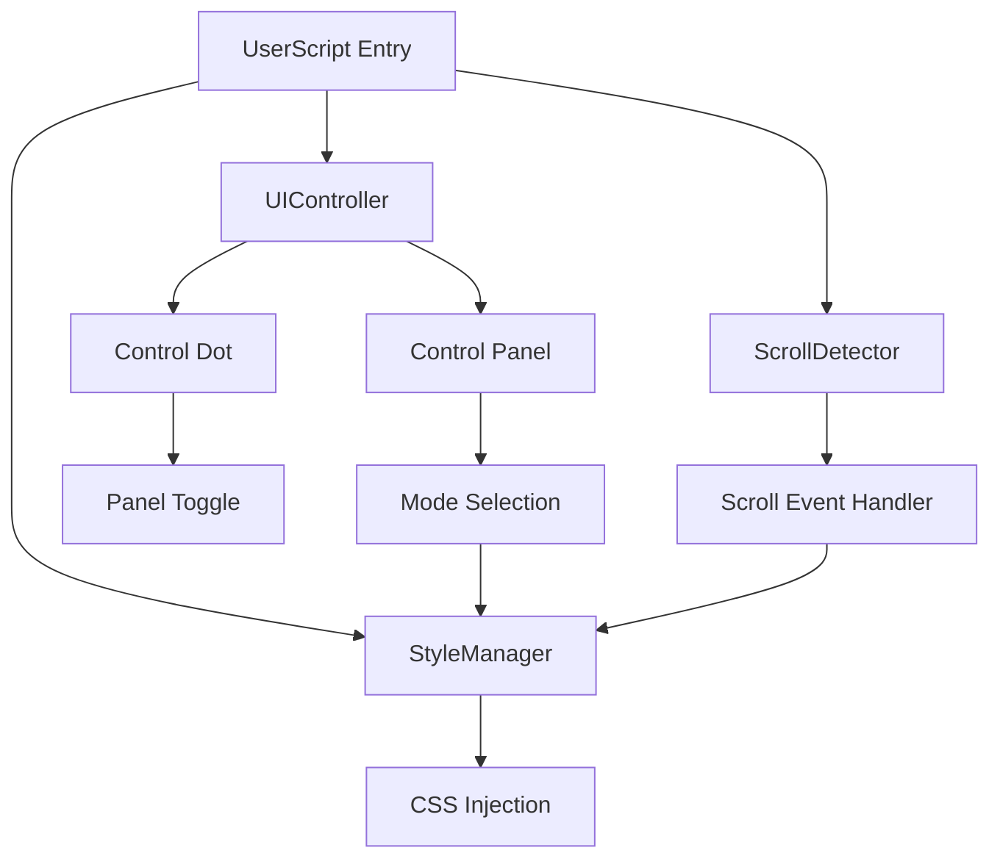

# 设计文档

## 概述

这个油猴脚本将通过动态CSS注入和JavaScript事件处理来实现滚动条的精细控制。脚本采用模块化设计，包含UI组件、样式管理器和事件处理器，确保在任意网页上都能稳定运行。

## 架构

### 核心组件架构



### 主要模块

1. **StyleManager** - 负责CSS样式的动态注入和管理
2. **UIController** - 管理用户界面组件的创建和交互
3. **ScrollDetector** - 检测滚动事件并触发相应的样式变化
4. **EventHandler** - 处理用户交互事件

## 组件和接口

### StyleManager 类

```javascript
class StyleManager {
    constructor()
    setMode(mode: 'default' | 'always' | 'semi')
    injectBaseStyles()
    showScrollbar()
    hideScrollbar()
    cleanup()
}
```

**职责：**
- 管理三种滚动条显示模式的CSS规则
- 动态注入和移除样式
- 处理不同浏览器的兼容性

### UIController 类

```javascript
class UIController {
    constructor(styleManager: StyleManager)
    createControlDot()
    createControlPanel()
    togglePanel()
    handleModeChange(mode: string)
    destroy()
}
```

**职责：**
- 创建和管理控制圆点
- 创建和管理控制面板
- 处理用户界面交互

### ScrollDetector 类

```javascript
class ScrollDetector {
    constructor(styleManager: StyleManager)
    startDetection()
    stopDetection()
    onScrollStart()
    onScrollEnd()
}
```

**职责：**
- 检测滚动开始和结束事件
- 在semi模式下控制滚动条的显示和隐藏
- 管理滚动超时逻辑

## 数据模型

### 滚动条模式枚举

```javascript
const ScrollbarModes = {
    DEFAULT: 'default',    // 显示原始滚动条
    ALWAYS: 'always',      // 永远隐藏滚动条
    SEMI: 'semi'           // 滚动时显示，停止后隐藏
};
```

### UI状态对象

```javascript
const UIState = {
    currentMode: 'default',
    panelVisible: false,
    controlDotElement: null,
    controlPanelElement: null
};
```

## 错误处理

### CSS注入失败处理

- 检测样式注入是否成功
- 提供降级方案，使用内联样式
- 记录错误信息到控制台

### DOM操作异常处理

- 使用try-catch包装所有DOM操作
- 检查元素存在性后再进行操作
- 提供清理机制防止内存泄漏

### 浏览器兼容性处理

- 检测浏览器类型和版本
- 为不同浏览器提供特定的CSS前缀
- 处理旧版浏览器的API差异

## 测试策略

### 功能测试重点

1. **滚动条控制测试**
   - 验证三种模式下滚动条的显示行为
   - 确认滚动功能不受影响
   - 测试不同页面长度的兼容性

2. **用户界面测试**
   - 验证控制圆点的位置和样式
   - 测试控制面板的显示和隐藏
   - 确认模式切换的响应性

3. **兼容性测试**
   - 测试主流浏览器的兼容性
   - 验证不同网站的适配性
   - 测试响应式设计的影响

### 性能测试

- 监控CSS注入的性能影响
- 测试滚动事件处理的性能
- 验证内存使用情况

### 边界条件测试

- 测试极长页面的滚动性能
- 验证动态内容变化的适应性
- 测试多个iframe的情况

## 实现细节

### CSS滚动条隐藏策略

```css
/* Webkit浏览器 */
::-webkit-scrollbar {
    width: 0px;
    background: transparent;
}

/* Firefox */
html {
    scrollbar-width: none;
}

/* IE和Edge */
body {
    -ms-overflow-style: none;
}
```

### Semi模式实现逻辑

1. 监听scroll事件
2. 滚动开始时显示滚动条
3. 使用防抖技术检测滚动结束
4. 滚动结束后延迟隐藏滚动条

### 控制面板布局

- 使用fixed定位确保始终可见
- 采用flexbox布局实现响应式设计
- 使用CSS动画提供平滑的显示/隐藏效果

### 事件处理优化

- 使用事件委托减少事件监听器数量
- 实现防抖和节流机制优化性能
- 提供清理机制防止内存泄漏
