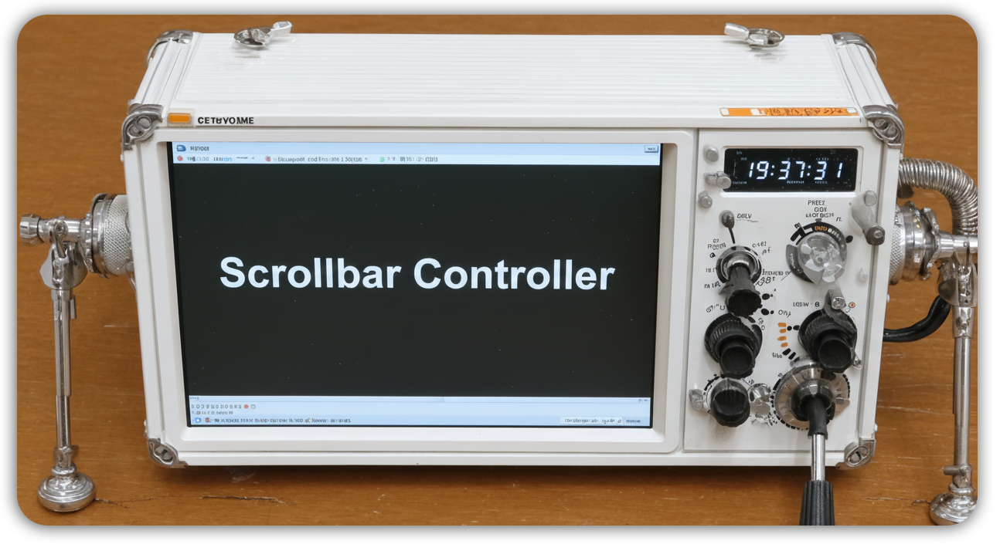

# 滚动条控制器 (Scrollbar Controller)


一个模块化的油猴脚本，提供对网页滚动条显示的精细控制，支持三种显示模式和自动滚动功能。该项目采用现代JavaScript模块化架构，具有良好的可维护性和可扩展性。



## 项目目的

本项目旨在：
- 提供对网页滚动条的精细控制，改善用户浏览体验
- 通过模块化架构提高代码的可维护性和可扩展性
- 为未来的网页自动化控制功能提供扩展基础
- 建立完整的开发工作流，包括构建系统和CI/CD流程

## 功能特性

- **三种显示模式**：默认、永久显示、智能显示
- **自动滚动**：平滑的自动页面滚动，可调节速度
- **键盘快捷键**：快速模式切换和自动滚动控制
- **可视化控制**：直观的圆点指示器和控制面板
- **跨浏览器兼容**：支持Chrome、Firefox、Safari和Edge
- **模块化架构**：清晰、可维护的代码结构
- **扩展系统**：支持自定义插件和扩展

## 项目结构

```
scrollbar-controller/
├── src/                          # 源代码
│   ├── core/                     # 核心模块
│   ├── managers/                 # 管理器模块
│   ├── ui/                       # 用户界面模块
│   ├── detectors/                # 检测器模块
│   ├── utils/                    # 工具模块
│   ├── extensions/               # 扩展模块
│   └── main.js                   # 入口文件
├── build/                        # 构建脚本
├── dist/                         # 构建输出
├── docs/                         # 文档
└── .github/workflows/            # CI/CD配置
```

## 开发

### 环境要求
- Node.js 14.0.0 或更高版本
- npm 或 yarn

### 开发设置

#### 1. 环境准备
```bash
# 克隆仓库
git clone https://github.com/karminski/scrollbar-controller.git
cd scrollbar-controller

# 安装依赖
npm install
```

#### 2. 开发流程
```bash
# 开发模式构建（包含源码映射和调试信息）
npm run build:dev

# 开发监听模式（文件变化时自动重新构建）
npm run build:watch

# 生产构建
npm run build

# 代码检查
npm run lint

# 清理构建目录
npm run clean
```

#### 3. 测试构建结果
```bash
# 运行功能测试
npm test

# 测试构建系统
node test/build-system-test.js

# 测试CI/CD流程
node test/ci-cd-test.js
```

### 可用脚本详解

| 命令 | 描述 | 用途 |
|------|------|------|
| `npm run build` | 构建生产版本 | 生成最终的用户脚本文件 |
| `npm run build:dev` | 构建开发版本 | 包含调试信息和源码映射 |
| `npm run build:watch` | 监听模式构建 | 开发时自动重新构建 |
| `npm run lint` | 代码检查 | 检查代码风格和潜在问题 |
| `npm run clean` | 清理目录 | 删除构建产物和临时文件 |
| `npm test` | 运行测试 | 执行功能和集成测试 |

### 开发工作流

1. **修改源码**：在 `src/` 目录下修改相应模块
2. **实时构建**：运行 `npm run build:watch` 监听文件变化
3. **测试功能**：在浏览器中测试生成的脚本
4. **代码检查**：运行 `npm run lint` 确保代码质量
5. **提交代码**：Git提交会自动触发CI/CD流程

## 安装使用

### 方式一：使用预构建版本

1. 安装 [Tampermonkey](https://www.tampermonkey.net/) 浏览器扩展
2. 从 [Releases](https://github.com/karminski/scrollbar-controller/releases) 页面下载最新的 `scrollbar-control.user.js` 文件
3. 在Tampermonkey中点击"添加新脚本"，将下载的文件内容复制粘贴进去
4. 保存脚本，它将自动在所有网站上运行

### 方式二：从源码构建

1. 克隆仓库并构建：
```bash
git clone https://github.com/karminski/scrollbar-controller.git
cd scrollbar-controller
npm install
npm run build
```

2. 安装生成的 `dist/scrollbar-control.user.js` 文件到Tampermonkey

### 验证安装

安装成功后，访问任何网页，你应该能看到：
- 页面右上角出现一个小圆点控制器
- 可以通过键盘快捷键控制滚动条模式

## 使用说明

### 可视化控制
- **控制圆点**：页面右上角出现小圆点
- **点击圆点**：打开控制面板
- **控制面板**：提供模式切换和自动滚动控制按钮

### 键盘快捷键
- `Ctrl+Shift+S`: 切换滚动条模式
- `Ctrl+Shift+A`: 开始/停止自动滚动
- `Ctrl+Shift+↑/↓`: 调整自动滚动速度

### 控制模式

- **默认模式**：使用网站原始滚动条设置
- **永久模式**：强制滚动条始终可见
- **智能模式**：仅在需要时显示滚动条（悬停或滚动时）

## 架构

项目采用模块化架构，包含以下关键组件：

- **Application**: 主应用控制器
- **EventBus**: 模块间通信系统
- **PluginManager**: 扩展和插件管理
- **StyleManager**: 滚动条样式管理
- **UIController**: 用户界面协调
- **AutoScrollManager**: 自动滚动功能

详细架构信息请参考 [docs/architecture.md](docs/architecture.md)。

## 扩展开发

项目支持自定义扩展和插件。开发指南请参考 [docs/extensions.md](docs/extensions.md)。

## 浏览器支持

- ✅ Chrome/Chromium（完全支持）
- ✅ Firefox（完全支持）
- ✅ Safari（基本支持）
- ✅ Edge（完全支持）

## 构建系统

项目使用自定义构建系统将模块化源码合并为单文件油猴脚本：

### 构建流程
1. **依赖分析**：解析ES6模块的import/export关系
2. **模块合并**：按依赖顺序合并所有模块
3. **代码转换**：处理模块作用域和兼容性
4. **元数据添加**：添加油猴脚本头部信息
5. **产物生成**：输出最终的用户脚本文件

### 构建配置
构建配置位于 `build/` 目录：
- `build.js`：主构建脚本
- `template.js`：脚本模板和元数据
- `DependencyAnalyzer.js`：依赖分析器
- `ModuleMerger.js`：模块合并器

## CI/CD 流程

项目配置了完整的GitHub Actions工作流：

### 自动化流程
- **代码推送**：自动触发构建和测试
- **Pull Request**：自动检查代码质量
- **发布标签**：自动构建并发布新版本
- **构建产物**：自动保存构建结果

### 工作流文件
- `.github/workflows/build.yml`：主构建流程
- `.github/workflows/pr-check.yml`：PR检查流程
- `.github/workflows/release.yml`：发布流程

## 贡献指南

### 贡献流程
1. Fork 仓库到你的GitHub账户
2. 创建功能分支：`git checkout -b feature/your-feature`
3. 进行代码更改
4. 运行测试和代码检查：`npm test && npm run lint`
5. 提交更改：`git commit -m "Add your feature"`
6. 推送分支：`git push origin feature/your-feature`
7. 创建 Pull Request

### 代码规范
- 遵循ESLint配置的代码风格
- 为新功能添加相应的测试
- 更新相关文档
- 确保所有测试通过

### 问题报告
如果发现bug或有功能建议，请：
1. 搜索现有Issues确认问题未被报告
2. 创建新Issue，详细描述问题或建议
3. 提供复现步骤和环境信息

## 许可证

MIT License - 详见 [LICENSE](LICENSE) 文件

---

**注意**：此脚本仅影响滚动条的视觉显示，不会影响网页的滚动功能。
