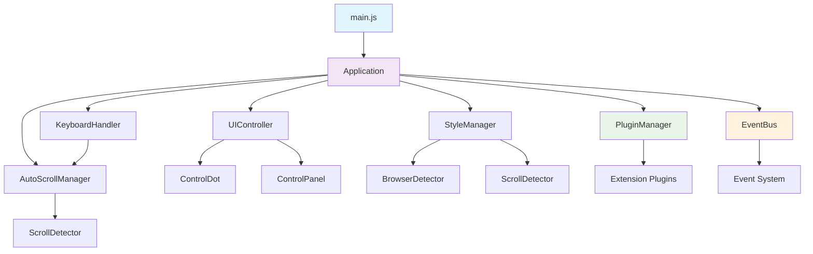
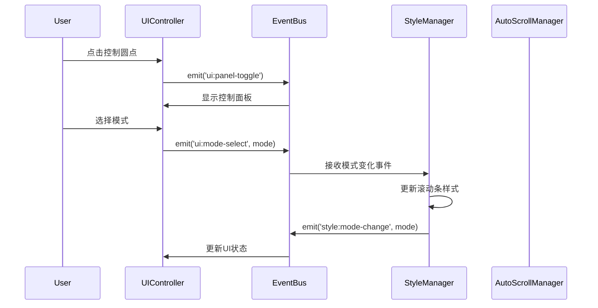

# 滚动条控制器架构文档

## 概述

滚动条控制器采用模块化架构设计，将原始的单文件脚本重构为清晰分层的模块系统。该架构支持良好的可维护性、可扩展性，并为未来的网页自动化控制功能提供了扩展基础。

## 架构原则

### 1. 模块化设计
- 每个模块职责单一，边界清晰
- 使用ES6模块系统进行开发
- 构建时合并为单文件油猴脚本

### 2. 事件驱动架构
- 模块间通过事件系统进行解耦通信
- 支持发布-订阅模式
- 便于扩展和插件开发

### 3. 插件系统
- 支持动态插件注册和管理
- 提供标准化的扩展接口
- 为网页自动化功能预留扩展点

### 4. 分层架构
- 核心层：基础设施和框架
- 管理层：业务逻辑管理
- 界面层：用户交互界面
- 工具层：通用工具和常量

## 项目结构

```
scrollbar-controller/
├── src/                          # 源代码目录
│   ├── core/                     # 核心模块
│   │   ├── Application.js        # 主应用类
│   │   ├── EventBus.js           # 事件总线
│   │   └── PluginManager.js      # 插件管理器
│   ├── managers/                 # 管理器模块
│   │   ├── StyleManager.js       # 样式管理器
│   │   ├── AutoScrollManager.js  # 自动滚动管理器
│   │   └── KeyboardHandler.js    # 键盘处理器
│   ├── ui/                       # 用户界面模块
│   │   ├── UIController.js       # UI控制器
│   │   ├── ControlDot.js         # 控制圆点组件
│   │   └── ControlPanel.js       # 控制面板组件
│   ├── detectors/                # 检测器模块
│   │   ├── ScrollDetector.js     # 滚动检测器
│   │   └── BrowserDetector.js    # 浏览器检测器
│   ├── utils/                    # 工具模块
│   │   ├── constants.js          # 常量定义
│   │   ├── helpers.js            # 辅助函数
│   │   └── logger.js             # 日志工具
│   ├── extensions/               # 扩展模块目录
│   │   └── README.md             # 扩展开发指南
│   └── main.js                   # 入口文件
├── build/                        # 构建脚本目录
├── dist/                         # 构建产物目录
├── docs/                         # 文档目录
└── .github/workflows/            # CI/CD配置
```

## 核心架构图



## 模块详细说明

### 核心模块 (core/)

#### Application 类
**职责**：应用程序的主入口和生命周期管理

**接口**：
```javascript
class Application {
    constructor()
    initialize()                    // 初始化应用
    destroy()                      // 销毁应用
    getManager(name: string)       // 获取管理器实例
    registerPlugin(plugin: Plugin) // 注册插件
    emit(event: string, data: any) // 发送事件
    on(event: string, handler: function) // 监听事件
}
```

**关键功能**：
- 协调各个管理器和组件的初始化
- 提供统一的事件通信机制
- 管理应用程序生命周期
- 插件系统的入口点

#### EventBus 类
**职责**：提供组件间的解耦通信机制

**接口**：
```javascript
class EventBus {
    constructor()
    on(event: string, handler: function)    // 订阅事件
    off(event: string, handler: function)   // 取消订阅
    emit(event: string, data: any)          // 发布事件
    once(event: string, handler: function)  // 一次性订阅
}
```

**通信模式**：
- 发布-订阅模式
- 事件类型标准化
- 错误处理和调试支持

#### PluginManager 类
**职责**：管理插件的注册、加载和卸载

**接口**：
```javascript
class PluginManager {
    constructor(eventBus: EventBus)
    registerPlugin(plugin: Plugin)      // 注册插件
    unregisterPlugin(pluginId: string)  // 注销插件
    getPlugin(pluginId: string)         // 获取插件
    loadExtensions()                    // 加载扩展
}
```

### 管理器模块 (managers/)

#### StyleManager 类
**职责**：管理滚动条样式的动态注入

**核心功能**：
- 三种显示模式：默认、永久显示、智能显示
- 浏览器兼容性处理
- 动态CSS注入和移除
- 状态变化事件通知

**与其他模块的关系**：
- 依赖 BrowserDetector 进行浏览器检测
- 依赖 ScrollDetector 进行滚动状态检测
- 通过 EventBus 通知状态变化

#### AutoScrollManager 类
**职责**：管理自动滚动功能

**核心功能**：
- 平滑滚动动画
- 速度控制（1-10级）
- 边界检测和处理
- 滚动状态管理

#### KeyboardHandler 类
**职责**：处理键盘快捷键

**支持的快捷键**：
- `Ctrl+Shift+S`: 切换滚动条模式
- `Ctrl+Shift+A`: 开始/停止自动滚动
- `Ctrl+Shift+↑/↓`: 调整自动滚动速度

### 用户界面模块 (ui/)

#### UIController 类
**职责**：协调UI组件的创建和管理

**管理的组件**：
- ControlDot：控制圆点
- ControlPanel：控制面板

**交互流程**：
1. 创建控制圆点
2. 处理用户点击事件
3. 显示/隐藏控制面板
4. 同步UI状态

#### ControlDot 类
**职责**：创建和管理控制圆点

**视觉特性**：
- 位置：页面右上角
- 大小：20px圆形
- 颜色：根据当前模式变化
- 交互：点击展开控制面板

#### ControlPanel 类
**职责**：创建和管理控制面板

**功能组件**：
- 模式切换按钮
- 自动滚动控制
- 速度调节滑块
- 状态指示器

### 检测器模块 (detectors/)

#### BrowserDetector 类
**职责**：检测浏览器类型和版本

**检测能力**：
- Chrome/Chromium
- Firefox
- Safari
- Edge
- 移动端浏览器

#### ScrollDetector 类
**职责**：检测页面滚动状态

**检测功能**：
- 滚动位置变化
- 滚动方向
- 滚动速度
- 页面边界检测

### 工具模块 (utils/)

#### constants.js
**内容**：应用程序常量定义
- 滚动条模式枚举
- 事件类型定义
- UI配置常量
- 默认设置值

#### helpers.js
**内容**：通用辅助函数
- DOM操作工具
- 数值计算函数
- 字符串处理工具
- 类型检查函数

#### logger.js
**内容**：日志记录系统
- 不同级别的日志输出
- 调试信息记录
- 错误追踪功能

## 组件间通信机制

### 事件系统

项目使用事件驱动架构，主要事件类型包括：

#### 应用生命周期事件
- `app:init`: 应用初始化完成
- `app:destroy`: 应用销毁

#### 样式相关事件
- `style:mode-change`: 滚动条模式变化
- `scrollbar:show`: 滚动条显示
- `scrollbar:hide`: 滚动条隐藏

#### 滚动相关事件
- `scroll:start`: 开始滚动
- `scroll:end`: 滚动结束
- `auto-scroll:start`: 自动滚动开始
- `auto-scroll:stop`: 自动滚动停止

#### UI相关事件
- `ui:panel-toggle`: 控制面板切换
- `ui:mode-select`: 模式选择
- `ui:speed-change`: 速度变化

#### 插件相关事件
- `plugin:register`: 插件注册
- `plugin:unregister`: 插件注销

### 数据流



## 扩展系统架构

### 插件接口定义

```javascript
interface Plugin {
    id: string              // 插件唯一标识
    name: string           // 插件名称
    version: string        // 插件版本
    initialize(application: Application): void  // 初始化方法
    destroy(): void        // 销毁方法
    getAPI?(): object      // 可选的API接口
}
```

### 扩展点

系统预定义了以下扩展点：

- `BEFORE_INIT`: 应用初始化前
- `AFTER_INIT`: 应用初始化后
- `STYLE_CHANGE`: 样式变化时
- `SCROLL_EVENT`: 滚动事件时
- `UI_INTERACTION`: UI交互时
- `CUSTOM_CONTROL`: 自定义控制时

### 扩展开发示例

```javascript
class PageControlExtension {
    constructor() {
        this.id = 'page-control';
        this.name = 'Page Control Extension';
        this.version = '1.0.0';
    }
    
    initialize(application) {
        const eventBus = application.getEventBus();
        
        // 监听UI面板创建事件
        eventBus.on('ui:panel-create', this.addControlPanel.bind(this));
        
        // 注册页面控制API
        this.registerPageControlAPI(application);
    }
    
    addControlPanel(panel) {
        // 添加自定义控制元素
    }
    
    registerPageControlAPI(application) {
        // 注册页面控制相关的API
    }
}
```

## 构建系统架构

### 构建流程


### 构建组件

#### DependencyAnalyzer
**职责**：分析模块依赖关系
- 解析ES6 import/export语句
- 构建依赖关系图
- 确定模块加载顺序

#### ModuleMerger
**职责**：合并模块代码
- 按依赖顺序合并模块
- 处理模块作用域
- 移除import/export语句

#### OutputGenerator
**职责**：生成最终脚本
- 添加油猴脚本元数据
- 包装为IIFE格式
- 优化和压缩代码

## 性能考虑

### 内存管理
- 事件监听器的及时清理
- DOM元素的生命周期管理
- 插件资源的释放

### 执行效率
- 事件处理的防抖和节流
- DOM操作的批量处理
- 样式更新的优化

### 兼容性
- 浏览器特性检测
- 降级处理机制
- 错误恢复策略

## 安全考虑

### 代码注入防护
- 严格的输入验证
- DOM操作的安全处理
- 事件处理的安全检查

### 权限控制
- 最小权限原则
- 插件权限隔离
- 敏感操作的权限检查

## 未来扩展规划

### 网页自动化控制
- 页面元素选择和操作
- 用户交互模拟
- 自动化脚本引擎

### 高级功能
- 配置持久化
- 多站点配置
- 云端同步

### 性能优化
- 懒加载机制
- 缓存策略
- 资源预加载

这个架构设计确保了代码的模块化、可维护性和可扩展性，为项目的长期发展提供了坚实的基础。
