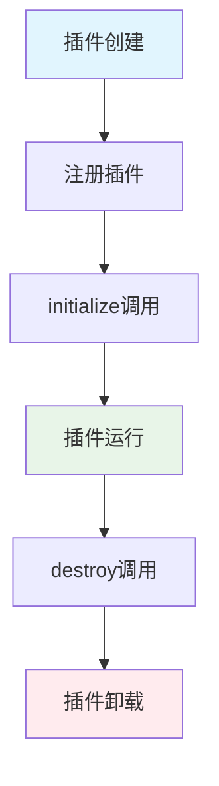

# 扩展开发指南

## 概述

滚动条控制器提供了强大的扩展系统，允许开发者创建自定义插件来扩展应用功能。扩展系统基于事件驱动架构，支持动态插件注册、生命周期管理和API接口。

## 扩展系统架构

### 核心组件

- **PluginManager**: 插件管理器，负责插件的注册、加载和卸载
- **EventBus**: 事件总线，提供插件间的通信机制
- **Application**: 主应用实例，提供核心API和服务

### 扩展点

系统预定义了以下扩展点，插件可以在这些点注入自定义逻辑：

```javascript
const ExtensionPoints = {
    BEFORE_INIT: 'before-init',        // 应用初始化前
    AFTER_INIT: 'after-init',          // 应用初始化后
    STYLE_CHANGE: 'style-change',      // 样式变化时
    SCROLL_EVENT: 'scroll-event',      // 滚动事件时
    UI_INTERACTION: 'ui-interaction',  // UI交互时
    CUSTOM_CONTROL: 'custom-control'   // 自定义控制时
};
```

## 插件接口规范

### 基础插件接口

所有插件必须实现以下接口：

```javascript
interface Plugin {
    id: string;              // 插件唯一标识符
    name: string;           // 插件显示名称
    version: string;        // 插件版本号
    description?: string;   // 插件描述（可选）
    author?: string;        // 插件作者（可选）
    
    // 必需方法
    initialize(application: Application): void;  // 初始化插件
    destroy(): void;                            // 销毁插件
    
    // 可选方法
    getAPI?(): object;      // 返回插件API接口
    getConfig?(): object;   // 返回插件配置
}
```

### 插件生命周期



## 开发第一个插件

### 1. 基础插件模板

```javascript
// src/extensions/MyFirstPlugin.js
class MyFirstPlugin {
    constructor() {
        this.id = 'my-first-plugin';
        this.name = 'My First Plugin';
        this.version = '1.0.0';
        this.description = '我的第一个插件示例';
        this.author = 'Your Name';
    }
    
    initialize(application) {
        console.log('MyFirstPlugin initialized');
        
        // 获取事件总线
        this.eventBus = application.getEventBus();
        
        // 监听应用事件
        this.eventBus.on('app:init', this.onAppInit.bind(this));
        this.eventBus.on('style:mode-change', this.onModeChange.bind(this));
        
        // 注册自定义事件处理
        this.setupCustomHandlers();
    }
    
    destroy() {
        console.log('MyFirstPlugin destroyed');
        
        // 清理事件监听器
        if (this.eventBus) {
            this.eventBus.off('app:init', this.onAppInit);
            this.eventBus.off('style:mode-change', this.onModeChange);
        }
        
        // 清理其他资源
        this.cleanup();
    }
    
    onAppInit() {
        console.log('Application initialized, plugin ready');
    }
    
    onModeChange(mode) {
        console.log('Scrollbar mode changed to:', mode);
    }
    
    setupCustomHandlers() {
        // 设置自定义处理逻辑
    }
    
    cleanup() {
        // 清理插件资源
    }
    
    getAPI() {
        return {
            doSomething: this.doSomething.bind(this),
            getStatus: this.getStatus.bind(this)
        };
    }
    
    doSomething() {
        console.log('Plugin doing something...');
    }
    
    getStatus() {
        return {
            active: true,
            version: this.version
        };
    }
}

export { MyFirstPlugin };
```

### 2. 注册插件

```javascript
// 在main.js中注册插件
import { MyFirstPlugin } from './extensions/MyFirstPlugin.js';

// 创建应用实例
const app = new Application();

// 注册插件
const myPlugin = new MyFirstPlugin();
app.registerPlugin(myPlugin);

// 初始化应用
app.initialize();
```

## 高级插件开发

### 网页控制功能插件

以下是一个网页自动化控制插件的示例：

```javascript
// src/extensions/PageControlPlugin.js
class PageControlPlugin {
    constructor() {
        this.id = 'page-control';
        this.name = 'Page Control Plugin';
        this.version = '1.0.0';
        this.description = '网页自动化控制插件';
        
        this.controlActions = new Map();
        this.isRecording = false;
        this.recordedActions = [];
    }
    
    initialize(application) {
        this.application = application;
        this.eventBus = application.getEventBus();
        
        // 监听UI面板创建事件，添加自定义控制
        this.eventBus.on('ui:panel-create', this.addControlPanel.bind(this));
        
        // 注册页面控制API
        this.registerPageControlAPI();
        
        // 设置页面监听器
        this.setupPageListeners();
    }
    
    destroy() {
        this.cleanup();
    }
    
    addControlPanel(panel) {
        // 创建页面控制区域
        const controlSection = document.createElement('div');
        controlSection.className = 'page-control-section';
        controlSection.innerHTML = `
            <h4>页面控制</h4>
            <button id="start-recording">开始录制</button>
            <button id="stop-recording">停止录制</button>
            <button id="replay-actions">回放动作</button>
            <button id="auto-fill-form">自动填表</button>
            <div id="recorded-actions"></div>
        `;
        
        panel.appendChild(controlSection);
        
        // 绑定事件处理器
        this.bindControlEvents(controlSection);
    }
    
    bindControlEvents(section) {
        const startBtn = section.querySelector('#start-recording');
        const stopBtn = section.querySelector('#stop-recording');
        const replayBtn = section.querySelector('#replay-actions');
        const fillBtn = section.querySelector('#auto-fill-form');
        
        startBtn.addEventListener('click', () => this.startRecording());
        stopBtn.addEventListener('click', () => this.stopRecording());
        replayBtn.addEventListener('click', () => this.replayActions());
        fillBtn.addEventListener('click', () => this.autoFillForm());
    }
    
    registerPageControlAPI() {
        // 注册全局API
        this.api = {
            // 元素选择和操作
            selectElement: this.selectElement.bind(this),
            clickElement: this.clickElement.bind(this),
            fillInput: this.fillInput.bind(this),
            
            // 页面导航
            navigateTo: this.navigateTo.bind(this),
            waitForElement: this.waitForElement.bind(this),
            
            // 数据提取
            extractText: this.extractText.bind(this),
            extractData: this.extractData.bind(this),
            
            // 自动化脚本
            recordActions: this.recordActions.bind(this),
            replayActions: this.replayActions.bind(this),
            
            // 表单处理
            autoFillForm: this.autoFillForm.bind(this),
            submitForm: this.submitForm.bind(this)
        };
    }
    
    setupPageListeners() {
        // 监听页面交互事件
        document.addEventListener('click', this.onPageClick.bind(this), true);
        document.addEventListener('input', this.onPageInput.bind(this), true);
        document.addEventListener('change', this.onPageChange.bind(this), true);
    }
    
    // API实现方法
    selectElement(selector) {
        try {
            const element = document.querySelector(selector);
            if (element) {
                this.highlightElement(element);
                return element;
            }
            throw new Error(`Element not found: ${selector}`);
        } catch (error) {
            console.error('selectElement error:', error);
            return null;
        }
    }
    
    clickElement(selector) {
        const element = this.selectElement(selector);
        if (element) {
            element.click();
            this.recordAction('click', selector);
            return true;
        }
        return false;
    }
    
    fillInput(selector, value) {
        const element = this.selectElement(selector);
        if (element && (element.tagName === 'INPUT' || element.tagName === 'TEXTAREA')) {
            element.value = value;
            element.dispatchEvent(new Event('input', { bubbles: true }));
            element.dispatchEvent(new Event('change', { bubbles: true }));
            this.recordAction('fill', selector, value);
            return true;
        }
        return false;
    }
    
    async waitForElement(selector, timeout = 5000) {
        return new Promise((resolve, reject) => {
            const startTime = Date.now();
            
            const checkElement = () => {
                const element = document.querySelector(selector);
                if (element) {
                    resolve(element);
                } else if (Date.now() - startTime > timeout) {
                    reject(new Error(`Element not found within ${timeout}ms: ${selector}`));
                } else {
                    setTimeout(checkElement, 100);
                }
            };
            
            checkElement();
        });
    }
    
    extractText(selector) {
        const element = this.selectElement(selector);
        return element ? element.textContent.trim() : null;
    }
    
    extractData(config) {
        const data = {};
        
        for (const [key, selector] of Object.entries(config)) {
            const element = document.querySelector(selector);
            if (element) {
                data[key] = element.textContent.trim();
            }
        }
        
        return data;
    }
    
    // 录制和回放功能
    startRecording() {
        this.isRecording = true;
        this.recordedActions = [];
        console.log('Started recording user actions');
        
        this.eventBus.emit('page-control:recording-start');
    }
    
    stopRecording() {
        this.isRecording = false;
        console.log('Stopped recording. Actions:', this.recordedActions);
        
        this.eventBus.emit('page-control:recording-stop', this.recordedActions);
        this.updateRecordedActionsDisplay();
    }
    
    recordAction(type, selector, value = null) {
        if (this.isRecording) {
            const action = {
                type,
                selector,
                value,
                timestamp: Date.now()
            };
            
            this.recordedActions.push(action);
        }
    }
    
    async replayActions() {
        console.log('Replaying recorded actions...');
        
        for (const action of this.recordedActions) {
            try {
                switch (action.type) {
                    case 'click':
                        await this.clickElement(action.selector);
                        break;
                    case 'fill':
                        await this.fillInput(action.selector, action.value);
                        break;
                    default:
                        console.warn('Unknown action type:', action.type);
                }
                
                // 添加延迟以模拟人类操作
                await this.delay(500);
                
            } catch (error) {
                console.error('Error replaying action:', action, error);
            }
        }
        
        console.log('Replay completed');
    }
    
    // 自动填表功能
    autoFillForm(formData = null) {
        const forms = document.querySelectorAll('form');
        
        if (forms.length === 0) {
            console.warn('No forms found on page');
            return false;
        }
        
        // 使用默认数据或提供的数据
        const defaultData = {
            name: 'Test User',
            email: 'test@example.com',
            phone: '1234567890',
            message: 'This is a test message'
        };
        
        const data = formData || defaultData;
        
        forms.forEach((form, index) => {
            console.log(`Auto-filling form ${index + 1}`);
            
            // 查找并填充常见字段
            this.fillFormField(form, ['name', 'username', 'user'], data.name);
            this.fillFormField(form, ['email', 'mail'], data.email);
            this.fillFormField(form, ['phone', 'tel', 'mobile'], data.phone);
            this.fillFormField(form, ['message', 'comment', 'content'], data.message);
        });
        
        return true;
    }
    
    fillFormField(form, fieldNames, value) {
        for (const fieldName of fieldNames) {
            const field = form.querySelector(`input[name*="${fieldName}"], textarea[name*="${fieldName}"], input[id*="${fieldName}"], textarea[id*="${fieldName}"]`);
            
            if (field) {
                field.value = value;
                field.dispatchEvent(new Event('input', { bubbles: true }));
                field.dispatchEvent(new Event('change', { bubbles: true }));
                break;
            }
        }
    }
    
    // 工具方法
    highlightElement(element) {
        const originalStyle = element.style.cssText;
        element.style.cssText += 'outline: 2px solid red !important; outline-offset: 2px !important;';
        
        setTimeout(() => {
            element.style.cssText = originalStyle;
        }, 2000);
    }
    
    delay(ms) {
        return new Promise(resolve => setTimeout(resolve, ms));
    }
    
    updateRecordedActionsDisplay() {
        const display = document.querySelector('#recorded-actions');
        if (display) {
            display.innerHTML = `
                <h5>录制的动作 (${this.recordedActions.length})</h5>
                <ul>
                    ${this.recordedActions.map(action => 
                        `<li>${action.type}: ${action.selector} ${action.value ? '= ' + action.value : ''}</li>`
                    ).join('')}
                </ul>
            `;
        }
    }
    
    // 事件处理器
    onPageClick(event) {
        if (this.isRecording) {
            const selector = this.generateSelector(event.target);
            this.recordAction('click', selector);
        }
    }
    
    onPageInput(event) {
        if (this.isRecording) {
            const selector = this.generateSelector(event.target);
            this.recordAction('fill', selector, event.target.value);
        }
    }
    
    onPageChange(event) {
        if (this.isRecording) {
            const selector = this.generateSelector(event.target);
            this.recordAction('change', selector, event.target.value);
        }
    }
    
    generateSelector(element) {
        // 生成元素的CSS选择器
        if (element.id) {
            return `#${element.id}`;
        }
        
        if (element.className) {
            return `.${element.className.split(' ').join('.')}`;
        }
        
        if (element.name) {
            return `[name="${element.name}"]`;
        }
        
        // 生成基于标签和位置的选择器
        const tag = element.tagName.toLowerCase();
        const parent = element.parentElement;
        
        if (parent) {
            const siblings = Array.from(parent.children).filter(child => child.tagName === element.tagName);
            const index = siblings.indexOf(element);
            
            if (siblings.length > 1) {
                return `${tag}:nth-of-type(${index + 1})`;
            }
        }
        
        return tag;
    }
    
    cleanup() {
        // 清理事件监听器
        document.removeEventListener('click', this.onPageClick, true);
        document.removeEventListener('input', this.onPageInput, true);
        document.removeEventListener('change', this.onPageChange, true);
        
        // 清理其他资源
        this.controlActions.clear();
        this.recordedActions = [];
    }
    
    getAPI() {
        return this.api;
    }
}

export { PageControlPlugin };
```

## 插件开发最佳实践

### 1. 命名规范

- **插件ID**: 使用kebab-case格式，如 `page-control`, `auto-form-filler`
- **类名**: 使用PascalCase格式，如 `PageControlPlugin`, `AutoFormFillerPlugin`
- **文件名**: 与类名保持一致，如 `PageControlPlugin.js`

### 2. 错误处理

```javascript
class SafePlugin {
    initialize(application) {
        try {
            // 插件初始化逻辑
            this.setupPlugin(application);
        } catch (error) {
            console.error(`Plugin ${this.id} initialization failed:`, error);
            // 不要让插件错误影响主应用
        }
    }
    
    setupPlugin(application) {
        // 实际的初始化逻辑
    }
    
    safeExecute(fn, ...args) {
        try {
            return fn.apply(this, args);
        } catch (error) {
            console.error(`Plugin ${this.id} execution error:`, error);
            return null;
        }
    }
}
```

### 3. 资源管理

```javascript
class ResourceManagedPlugin {
    constructor() {
        this.eventListeners = [];
        this.timers = [];
        this.observers = [];
    }
    
    addEventListener(element, event, handler) {
        element.addEventListener(event, handler);
        this.eventListeners.push({ element, event, handler });
    }
    
    addTimer(timer) {
        this.timers.push(timer);
    }
    
    addObserver(observer) {
        this.observers.push(observer);
    }
    
    destroy() {
        // 清理事件监听器
        this.eventListeners.forEach(({ element, event, handler }) => {
            element.removeEventListener(event, handler);
        });
        
        // 清理定时器
        this.timers.forEach(timer => clearTimeout(timer));
        
        // 清理观察器
        this.observers.forEach(observer => observer.disconnect());
        
        // 清空数组
        this.eventListeners = [];
        this.timers = [];
        this.observers = [];
    }
}
```

### 4. 配置管理

```javascript
class ConfigurablePlugin {
    constructor(config = {}) {
        this.config = {
            // 默认配置
            enabled: true,
            autoStart: false,
            debugMode: false,
            ...config  // 用户配置覆盖默认配置
        };
    }
    
    updateConfig(newConfig) {
        this.config = { ...this.config, ...newConfig };
        this.onConfigChange();
    }
    
    onConfigChange() {
        // 配置变化时的处理逻辑
    }
    
    getConfig() {
        return { ...this.config };  // 返回配置副本
    }
}
```

## API参考

### Application API

```javascript
// 获取应用实例
const app = application;

// 事件系统
app.on(event, handler)          // 监听事件
app.off(event, handler)         // 取消监听
app.emit(event, data)           // 发送事件
app.once(event, handler)        // 一次性监听

// 管理器访问
app.getManager('style')         // 获取样式管理器
app.getManager('autoScroll')    // 获取自动滚动管理器
app.getManager('ui')            // 获取UI管理器
app.getManager('plugin')        // 获取插件管理器

// 插件管理
app.registerPlugin(plugin)      // 注册插件
app.getPlugin(pluginId)         // 获取插件实例
```

### EventBus API

```javascript
// 获取事件总线
const eventBus = application.getEventBus();

// 事件操作
eventBus.on(event, handler)     // 订阅事件
eventBus.off(event, handler)    // 取消订阅
eventBus.emit(event, data)      // 发布事件
eventBus.once(event, handler)   // 一次性订阅
```

### 常用事件类型

```javascript
// 应用生命周期
'app:init'                      // 应用初始化完成
'app:destroy'                   // 应用销毁

// 样式相关
'style:mode-change'             // 滚动条模式变化
'scrollbar:show'                // 滚动条显示
'scrollbar:hide'                // 滚动条隐藏

// 滚动相关
'scroll:start'                  // 开始滚动
'scroll:end'                    // 滚动结束
'auto-scroll:start'             // 自动滚动开始
'auto-scroll:stop'              // 自动滚动停止

// UI相关
'ui:panel-toggle'               // 控制面板切换
'ui:panel-create'               // 控制面板创建
'ui:mode-select'                // 模式选择
'ui:speed-change'               // 速度变化

// 插件相关
'plugin:register'               // 插件注册
'plugin:unregister'             // 插件注销
```

## 调试和测试

### 调试插件

```javascript
class DebuggablePlugin {
    constructor() {
        this.debug = true;  // 开发时设为true
    }
    
    log(...args) {
        if (this.debug) {
            console.log(`[${this.id}]`, ...args);
        }
    }
    
    error(...args) {
        console.error(`[${this.id}]`, ...args);
    }
    
    initialize(application) {
        this.log('Plugin initializing...');
        
        // 监听所有事件用于调试
        if (this.debug) {
            const originalEmit = application.getEventBus().emit;
            application.getEventBus().emit = (event, data) => {
                this.log('Event emitted:', event, data);
                return originalEmit.call(application.getEventBus(), event, data);
            };
        }
    }
}
```

### 测试插件

```javascript
// 简单的插件测试框架
class PluginTester {
    constructor(plugin) {
        this.plugin = plugin;
        this.tests = [];
    }
    
    addTest(name, testFn) {
        this.tests.push({ name, testFn });
    }
    
    async runTests() {
        console.log(`Running tests for ${this.plugin.id}...`);
        
        for (const test of this.tests) {
            try {
                await test.testFn();
                console.log(`✓ ${test.name}`);
            } catch (error) {
                console.error(`✗ ${test.name}:`, error);
            }
        }
    }
}

// 使用示例
const tester = new PluginTester(myPlugin);

tester.addTest('Plugin should initialize', () => {
    assert(myPlugin.id, 'Plugin should have an id');
    assert(myPlugin.name, 'Plugin should have a name');
});

tester.addTest('Plugin API should work', () => {
    const api = myPlugin.getAPI();
    assert(typeof api.doSomething === 'function', 'API should have doSomething method');
});

tester.runTests();
```

## 发布和分发

### 插件打包

```javascript
// build/plugin-builder.js
class PluginBuilder {
    static buildPlugin(pluginPath, outputPath) {
        // 读取插件源码
        const source = fs.readFileSync(pluginPath, 'utf8');
        
        // 添加插件包装器
        const wrapped = `
(function() {
    ${source}
    
    // 自动注册插件
    if (typeof window.ScrollbarController !== 'undefined') {
        const plugin = new ${this.extractClassName(source)}();
        window.ScrollbarController.registerPlugin(plugin);
    }
})();
        `;
        
        // 输出构建结果
        fs.writeFileSync(outputPath, wrapped);
    }
    
    static extractClassName(source) {
        const match = source.match(/class\s+(\w+)/);
        return match ? match[1] : 'UnknownPlugin';
    }
}
```

### 插件安装

用户可以通过以下方式安装插件：

1. **直接引入**：在主脚本后添加插件脚本
2. **动态加载**：通过插件管理器动态加载
3. **构建时集成**：在构建过程中集成插件

## 示例插件集合

### 1. 表单自动填充插件

```javascript
class AutoFormFillerPlugin {
    // 实现自动表单填充功能
}
```

### 2. 页面截图插件

```javascript
class PageScreenshotPlugin {
    // 实现页面截图功能
}
```

### 3. 数据提取插件

```javascript
class DataExtractorPlugin {
    // 实现页面数据提取功能
}
```

## 社区和支持

- **GitHub仓库**: [scrollbar-controller](https://github.com/karminski/scrollbar-controller)
- **问题报告**: 使用GitHub Issues报告bug或请求功能
- **讨论区**: 使用GitHub Discussions进行技术讨论
- **示例插件**: 查看 `src/extensions/examples/` 目录

## 总结

通过本指南，你应该能够：

1. 理解扩展系统的架构和工作原理
2. 创建基础和高级插件
3. 使用API进行网页控制和自动化
4. 遵循最佳实践进行插件开发
5. 调试和测试插件功能
6. 发布和分发插件

扩展系统为滚动条控制器提供了无限的可能性，让开发者能够根据具体需求创建定制化的网页控制功能。
